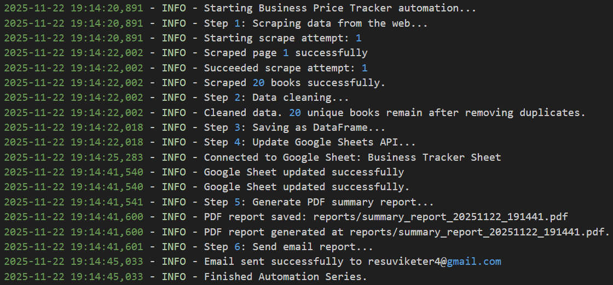
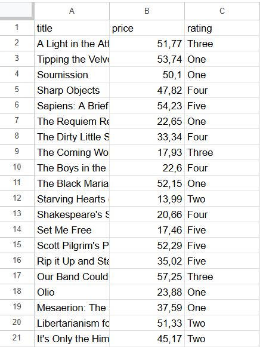
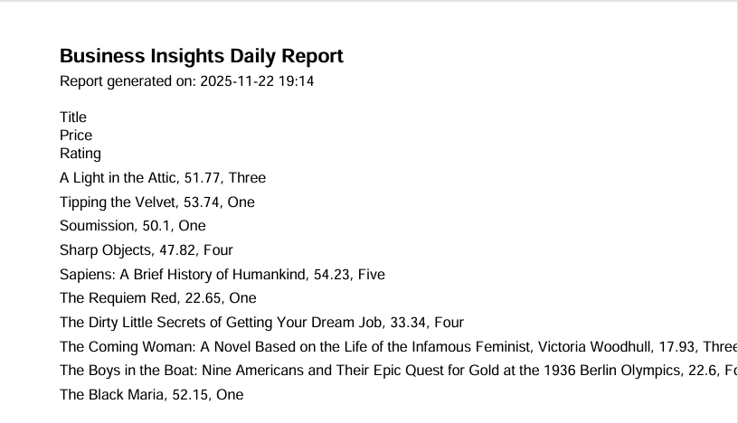
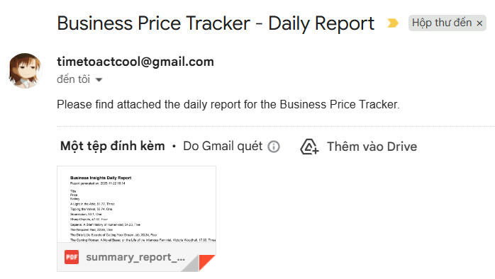

# Automation – Life Made Easier

This repository contains a Python-based automation project designed to streamline business price tracking. The automation updates Google Sheets, generates reports in PDF, and sends daily email notifications automatically.

---

## Features

* **Automatic Google Sheets Update:** Updates the title, price, and rating of products or books in a spreadsheet.
* **PDF Report Generation:** Creates a professional PDF report summarizing updated data.
* **Email Notifications:** Sends daily email reports with the PDF attached.
* **Comprehensive Logging:** Tracks all steps of the automation process.

---

## Folder Structure

```
Automation/
├── data/                # Stores temporary or raw data
├── models/              # Models or configuration for data processing
├── reports/             # Generated PDF reports
├── src/                 # Source code for automation
├── images/              # Screenshots for README references
├── requirements.txt
├── Dockerfile
├── cron.sh
├── scheduler.bat
└── README.md
```

---

## Installation

1. Clone the repository:

```bash
git clone https://github.com/WillyPhan06/Automation.git
cd Automation
```

2. Install dependencies:

```bash
pip install -r requirements.txt
```

3. Configure your Google Sheets API and email credentials in the source code.

---

## Usage

Run the automation script:

```bash
python src/main.py
```

**Full execution log example:**



---

### Google Sheets Update

The automation updates your spreadsheet automatically. Example with 20 books updated successfully:



---

### PDF Report

A PDF report is generated summarizing the updated data:



---

### Email Notification

Receive daily email notifications with the PDF report attached:



---

## Scheduling Automation

* **Windows:** Use `scheduler.bat`
* **Linux/macOS:** Use `cron.sh` for scheduling daily automation.

---

## Contributing

Contributions are welcome. Please open an issue or submit a pull request for any improvements or bug fixes.

---

## License

This project is licensed under the MIT License.
